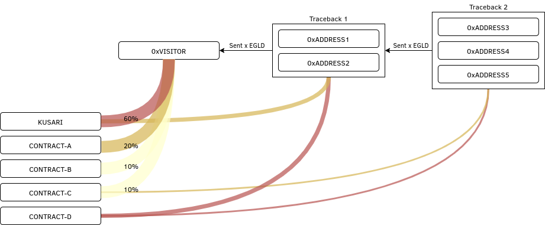

# Proposal-2

On-chain analysis via the observed addresses.

## Overview

When a contract updates us with something like `registerVisit(visitor)`, we can use chain-analysis to find out what other contracts this address has interacted with.

For example, we could say that `visitor` has interacted with `contract-A` and contract `contract-B`. If we check for address that interacted with `visitor`, we could say that tracing back 1 step, it has also interacted with `contract-C`. 

Overall, we could trace back N-steps and produce a graph like this:

## Advantages

It provides the client information about its users. What other contracts they use, frequency/amount, etc.

I allows to study the market and maybe even segment the users.

## Disadvatages

I see none for the client, but several for the users. It might expose them too much and does not respect their privacy.

Of course Elrond is not a private blockchain, but still, it is something we should be aware of.