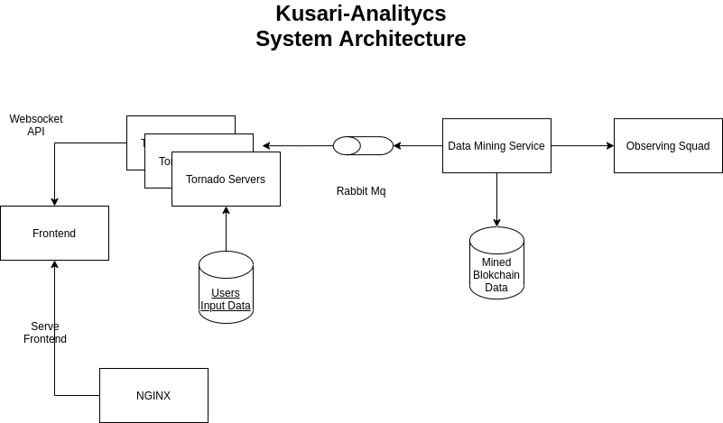

# Kusari Analitycs System Architecture

## Frontend

- A react app served by NGINX and connected to the tornado servers via websockets.

## NGINX

- Serves all the static content for the website.

## Tornado Servers

- Serves all the dynamic content, such as statistics, rankings...

## Users Input Data

- Stores User Votes, Sessions and other metadata...

## Rabbit MQ

- Used to update the data cached on the tornado servers from the Data Mining Service.

## Data Minig Service:

- Performs all the calculus of the blockchain metrics and stores it on the Mined Blockchain Data database.

## Mined Blokchain Database:

- Stores all the mined data.

## Observing Squad:

- Source of the blockchain data.
